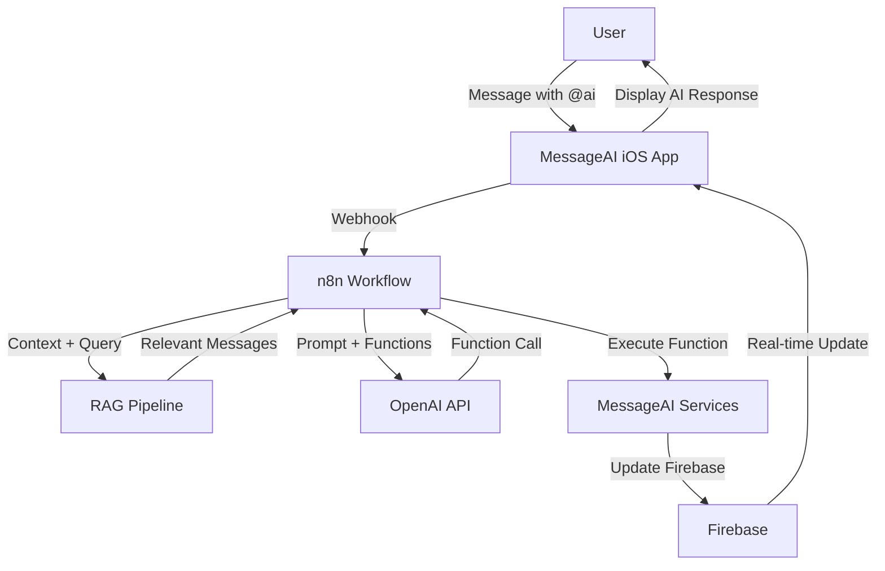

# AI Integration Guide

This document describes how to integrate AI capabilities into MessageAI using OpenAI function calling (Phase 3).

## Overview

MessageAI is designed to support AI-powered features through:
- **OpenAI Function Calling** - AI can call app functions to send messages, search, and summarize
- **RAG (Retrieval-Augmented Generation)** - Semantic search over message history
- **n8n Workflows** - Automation and webhook integration
- **Service Layer Abstraction** - Clean separation between AI and core app logic

## Architecture



## Phase 3 Implementation Plan

### 1. Service Layer (iOS)
Expose existing services as AI-callable functions.

**Already Implemented:**
- `MessageService.sendMessage(chatID:text:)` ✅
- `ChatService.fetchRecentMessages(chatID:limit:)` ✅
- `UserService.fetchUser(userID:)` ✅

**To Implement:**
- `MessageService.searchMessages(query:limit:chatID:)` 📝
- `MessageService.summarizeThread(chatID:messageCount:)` 📝
- Function validation and rate limiting 📝

### 2. n8n Webhook Integration
Set up workflow automation platform.

**Steps:**
1. Deploy n8n instance (self-hosted or cloud)
2. Create webhook endpoint for AI triggers
3. Set up Firebase Admin SDK access
4. Implement function calling logic
5. Add error handling and retry logic

**Webhook Flow:**
```
iOS App → Firebase Function → n8n Webhook → OpenAI → n8n → Firebase → iOS App
```

### 3. RAG Pipeline
Implement semantic search for context retrieval.

**Steps:**
1. Generate embeddings for all messages (OpenAI text-embedding-3-small)
2. Store embeddings in vector database (Pinecone/Weaviate/Qdrant)
3. Query vector DB for relevant messages
4. Pass context to OpenAI along with user query
5. Cache results to reduce costs

**Cost Estimate:**
- Embeddings: ~$0.0001 per 1k messages
- Vector DB: ~$10-30/month
- OpenAI API: ~$0.01 per search

### 4. OpenAI Function Calling
Configure AI to call MessageAI functions.

**Function Schemas:**
See [`function-schemas.json`](./function-schemas.json) for complete definitions.

**Example OpenAI Request:**
```json
{
  "model": "gpt-4-turbo-preview",
  "messages": [
    {
      "role": "system",
      "content": "You are a helpful assistant integrated into MessageAI. You can send messages, search conversations, and summarize threads using the provided functions."
    },
    {
      "role": "user",
      "content": "@ai Send a message to the team chat saying the meeting is moved to 3 PM"
    }
  ],
  "functions": [
    {
      "name": "sendMessage",
      "description": "Send a message to a chat",
      "parameters": {
        "type": "object",
        "properties": {
          "chatID": {
            "type": "string",
            "description": "Chat ID"
          },
          "text": {
            "type": "string",
            "description": "Message text"
          }
        },
        "required": ["chatID", "text"]
      }
    }
  ]
}
```

**Example OpenAI Response:**
```json
{
  "choices": [
    {
      "message": {
        "role": "assistant",
        "function_call": {
          "name": "sendMessage",
          "arguments": "{\"chatID\": \"chat_team\", \"text\": \"Meeting moved to 3 PM\"}"
        }
      }
    }
  ]
}
```

## Service Methods Available for AI

### 1. sendMessage
Send a message to a chat on behalf of the user.

```swift
// MessageService.swift
func sendMessage(chatID: String, text: String) async throws -> String {
    // 1. Validate user has access to chat
    // 2. Create message document
    // 3. Write to Firestore
    // 4. Return messageID
}
```

**Security:**
- User must be authenticated
- User must be a member of the chat
- Message validated before sending
- Rate limited (10 messages/minute)

### 2. searchMessages (To Be Implemented)
Search messages using text or semantic search.

```swift
// MessageService.swift (Phase 3)
func searchMessages(
    query: String,
    limit: Int = 20,
    chatID: String? = nil
) async throws -> [Message] {
    // Phase 2: Text-based search
    // Phase 3: Semantic search with embeddings
}
```

**Implementation Options:**
- **Option A**: Firestore full-text search (limited)
- **Option B**: Algolia integration (recommended)
- **Option C**: Vector database + embeddings (Phase 3)

### 3. summarizeThread (To Be Implemented)
Generate AI summary of conversation thread.

```swift
// MessageService.swift (Phase 3)
func summarizeThread(
    chatID: String,
    messageCount: Int = 50,
    summaryLength: SummaryLength = .moderate
) async throws -> ThreadSummary {
    // 1. Fetch recent messages
    // 2. Format as conversation
    // 3. Call OpenAI API with summarization prompt
    // 4. Return summary + metadata
}
```

## Security Considerations

### Authentication
- **Firebase Auth Required**: All AI actions must be authenticated
- **Token Validation**: Verify Firebase ID token before executing functions
- **User Context**: AI acts on behalf of authenticated user, not independently

### Authorization
- **Chat Membership**: AI can only access chats user has access to
- **Permission Checks**: Validate user permissions before every function call
- **Firestore Rules**: Backend rules enforce security even if AI bypasses client checks

### Rate Limiting
```typescript
// Firebase Cloud Function rate limiter
const rateLimits = {
  sendMessage: { max: 10, window: 60 },  // 10/min
  searchMessages: { max: 30, window: 60 },  // 30/min
  summarizeThread: { max: 10, window: 3600 }  // 10/hour (cost limit)
};
```

### Audit Logging
Log all AI-initiated actions:
```typescript
await logAIAction({
  userID: user.uid,
  action: 'sendMessage',
  chatID: chatID,
  success: true,
  timestamp: new Date()
});
```

## Cost Management

### OpenAI API Costs
| Operation | Model | Cost per Call | Notes |
|-----------|-------|---------------|-------|
| Function Calling | gpt-4-turbo | ~$0.01 | Depends on context length |
| Text Embeddings | text-embedding-3-small | ~$0.0001 | Per 1k tokens |
| Summarization | gpt-4-turbo | ~$0.02-0.05 | Depends on thread length |

### Cost Optimization
1. **Cache Summaries**: Don't regenerate for same thread
2. **Limit Context**: Only include relevant messages (RAG)
3. **Use Cheaper Models**: GPT-3.5-turbo for simple tasks
4. **Rate Limiting**: Prevent abuse with strict limits
5. **Batch Operations**: Combine multiple queries when possible

### Budget Alerts
Set up alerts in Firebase:
- $10/day = Warning
- $50/day = Critical
- $100/day = Disable AI features

## Development Workflow

### Local Development
1. **Firebase Emulator**: Test functions locally
2. **Mock OpenAI**: Use test responses to avoid costs
3. **n8n Local**: Run n8n in Docker for testing

```bash
# Start Firebase Emulator
firebase emulators:start

# Start n8n locally
docker run -it --rm --name n8n -p 5678:5678 n8nio/n8n
```

### Testing AI Functions
```swift
// MessageAITests/Integration/AIIntegrationTests.swift
@Test("AI Can Send Message via Function Call")
func aiCanSendMessageViaFunctionCall() async throws {
    let aiService = AIService(messageService: mockMessageService)
    
    let result = try await aiService.executeFunction(
        name: "sendMessage",
        arguments: ["chatID": "test-chat", "text": "AI test message"]
    )
    
    #expect(mockMessageService.sendMessageCalled)
    #expect(result.contains("msg_"))
}
```

## Implementation Checklist

### Phase 3.1: Basic Function Calling
- [ ] Create `AIService.swift` to handle OpenAI integration
- [ ] Implement `searchMessages()` in MessageService
- [ ] Set up Firebase Cloud Function for OpenAI proxy
- [ ] Deploy n8n webhook endpoint
- [ ] Test function calling end-to-end
- [ ] Add rate limiting and auth checks

### Phase 3.2: RAG Pipeline
- [ ] Choose vector database (Pinecone/Weaviate)
- [ ] Generate embeddings for existing messages
- [ ] Implement semantic search
- [ ] Integrate with OpenAI function calling
- [ ] Add caching layer
- [ ] Monitor costs and performance

### Phase 3.3: Thread Summarization
- [ ] Implement `summarizeThread()` method
- [ ] Create summarization prompts
- [ ] Add summary caching
- [ ] Test with various thread lengths
- [ ] Add cost tracking
- [ ] Deploy to production

## Monitoring & Observability

### Key Metrics
- **Function Call Success Rate**: > 95%
- **Average Latency**: < 2 seconds
- **Cost per User per Day**: < $0.10
- **Rate Limit Violations**: < 1% of requests
- **AI Response Quality**: User satisfaction score > 4/5

### Logging
```swift
Logger.ai.info("AI function call", metadata: [
    "function": "\(functionName)",
    "userID": "\(userID)",
    "chatID": "\(chatID)",
    "duration": "\(duration)ms",
    "cost": "$\(cost)"
])
```

## Future Enhancements

### Phase 4
- **Smart Replies**: AI-suggested responses
- **Translation**: Multi-language support
- **Action Items**: Extract to-dos from conversations
- **Sentiment Analysis**: Detect tone and emotions
- **Voice Integration**: Transcribe voice messages

### Phase 5
- **Proactive AI**: AI initiates helpful actions
- **Learning**: Personalized AI based on user behavior
- **Multi-Agent**: Multiple AI personas for different tasks

## References

- [OpenAI Function Calling Guide](https://platform.openai.com/docs/guides/function-calling)
- [n8n Documentation](https://docs.n8n.io/)
- [Firebase Cloud Functions](https://firebase.google.com/docs/functions)
- [RAG Best Practices](https://www.pinecone.io/learn/retrieval-augmented-generation/)

---

**Status**: Planning (Phase 3)  
**Owner**: MessageAI Team  
**Last Updated**: October 2025

