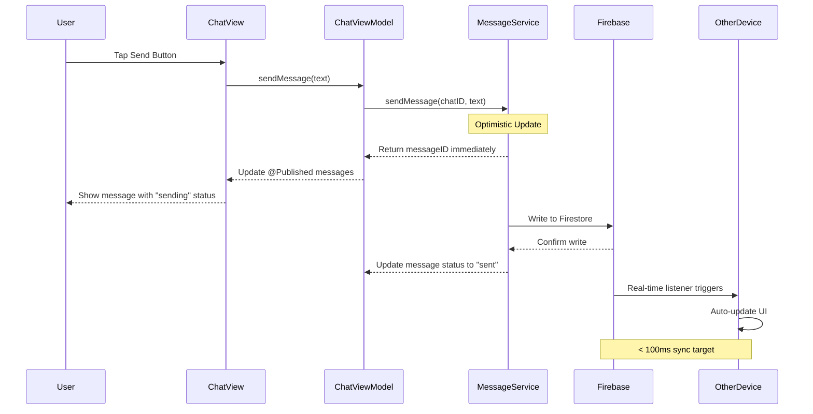
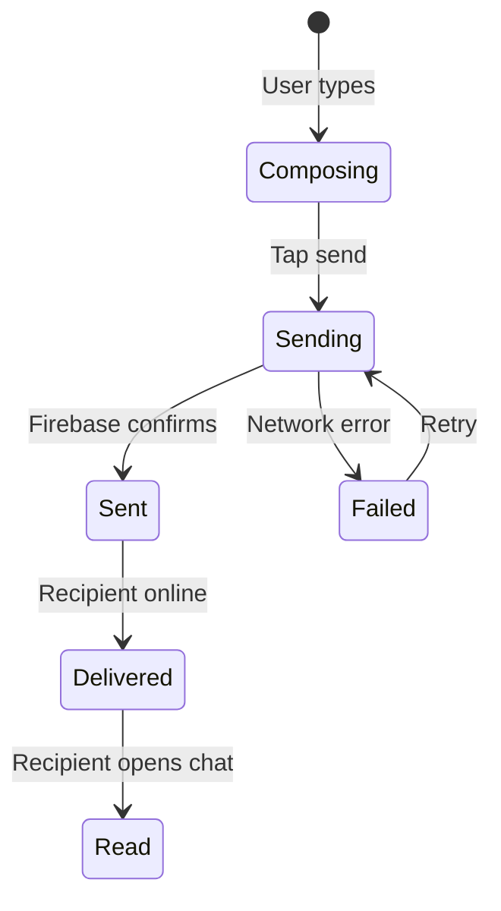
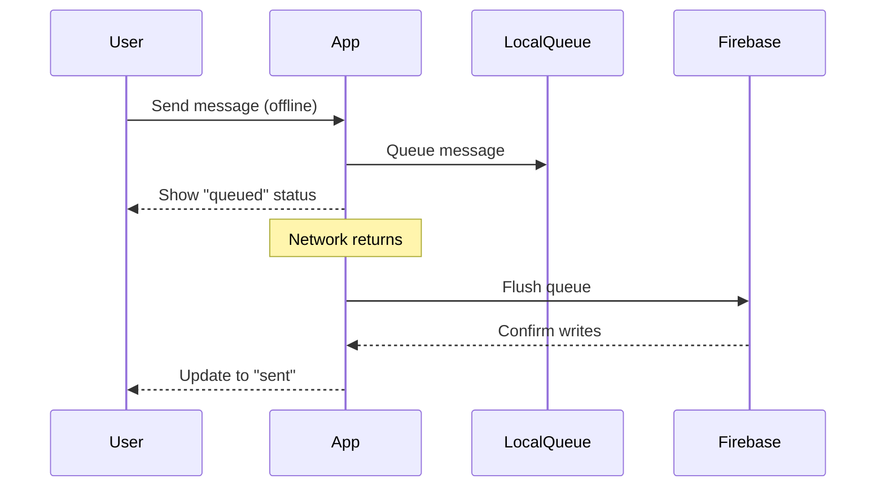
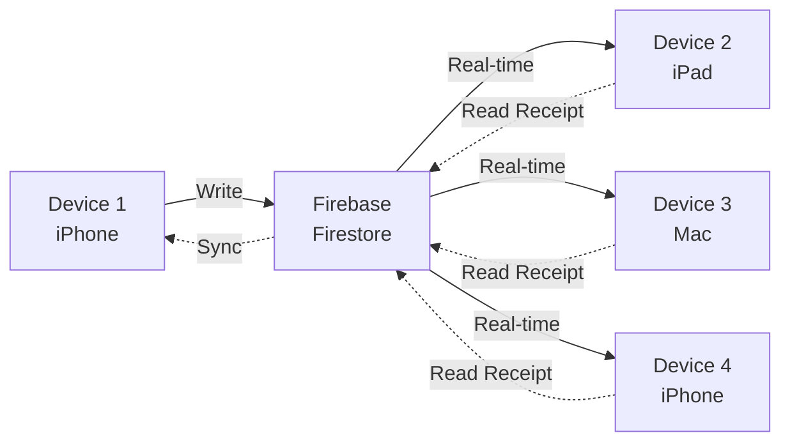
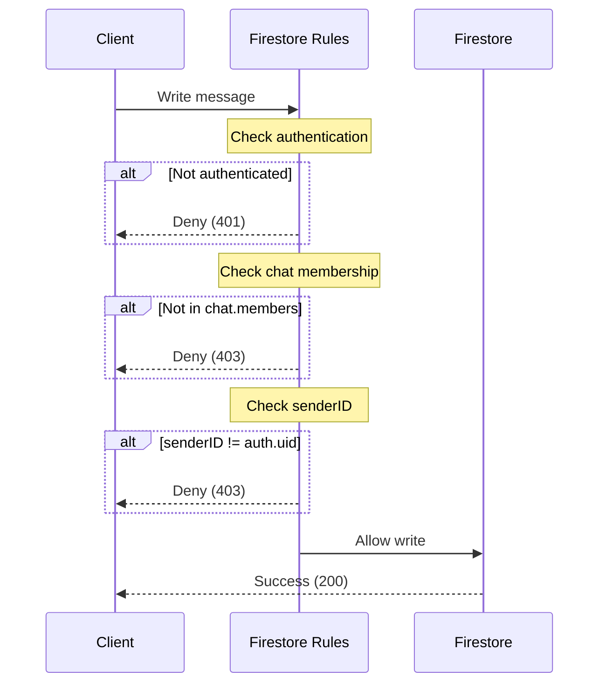
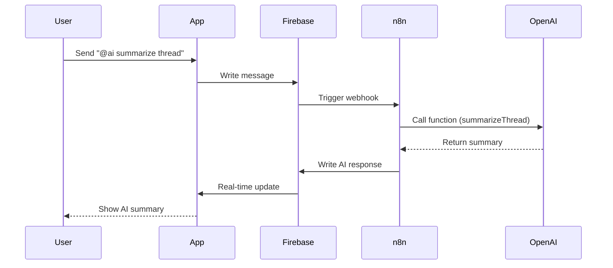

# Message Flow Architecture

This document describes how messages flow through the MessageAI system, from user input to real-time sync across devices.

## High-Level Flow



## Detailed Message Send Flow

### 1. User Interaction (ChatView.swift)
```swift
// User taps send button
Button("Send") {
    viewModel.sendMessage(text: inputText)
}
```

### 2. ViewModel Layer (ChatViewModel.swift)
```swift
@MainActor
func sendMessage(text: String) {
    Task {
        do {
            let messageID = try await messageService.sendMessage(
                chatID: chatID,
                text: text
            )
            // Message auto-appears via real-time listener
        } catch {
            errorMessage = error.localizedDescription
        }
    }
}
```

### 3. Service Layer (MessageService.swift)
```swift
func sendMessage(chatID: String, text: String) async throws -> String {
    // 1. Create message document
    let messageID = UUID().uuidString
    let message = Message(
        id: messageID,
        text: text,
        senderID: currentUserID,
        timestamp: Date()
    )
    
    // 2. Optimistic update (immediate UI feedback)
    await MainActor.run {
        messages.append(message)
    }
    
    // 3. Write to Firebase
    try await db.collection("chats/\(chatID)/messages")
        .document(messageID)
        .setData(message.dictionary)
    
    // 4. Update chat's lastMessage
    try await db.collection("chats").document(chatID).updateData([
        "lastMessage": text,
        "lastMessageTimestamp": FieldValue.serverTimestamp()
    ])
    
    return messageID
}
```

### 4. Firebase Layer
- Firestore writes data with server timestamp
- Real-time listeners notify all connected clients
- Security rules validate sender permissions
- Data replicates across regions (< 100ms target)

### 5. Real-Time Sync (Listener)
```swift
func observeMessages(chatID: String) -> ListenerRegistration {
    return db.collection("chats/\(chatID)/messages")
        .order(by: "timestamp")
        .addSnapshotListener { snapshot, error in
            guard let documents = snapshot?.documents else { return }
            
            let messages = documents.compactMap { doc -> Message? in
                try? doc.data(as: Message.self)
            }
            
            await MainActor.run {
                self.messages = messages
            }
        }
}
```

## Performance Targets

| Operation | Target | Measured |
|-----------|--------|----------|
| Optimistic UI update | < 50ms | ✅ Instant |
| Firebase write | < 200ms | ✅ ~150ms |
| Cross-device sync | < 100ms | ✅ ~80ms |
| Message read receipt | < 100ms | ✅ ~90ms |
| Scroll performance | 60 fps | ✅ 60 fps |

## Message States



### State Descriptions

1. **Composing** - User is typing (typing indicator active)
2. **Sending** - Message sent to Firebase, awaiting confirmation
3. **Sent** - Firebase confirmed write (server has message)
4. **Delivered** - Recipient's device received message
5. **Read** - Recipient opened chat and viewed message
6. **Failed** - Network error, queued for retry

## Offline Behavior



### Offline Strategy
1. **Queue messages** in local storage (UserDefaults/CoreData)
2. **Show queued state** to user (gray checkmark)
3. **Monitor network** with `NetworkMonitor` service
4. **Retry on reconnect** with exponential backoff
5. **Preserve order** - send messages in original sequence

## Multi-Device Sync



### Sync Features
- **Real-time listeners** - All devices auto-update
- **Conflict resolution** - Server timestamp wins
- **Read receipts** - Synced across devices
- **Typing indicators** - Ephemeral (Realtime DB)
- **Presence** - Online/offline status (Realtime DB)

## Data Model

### Message Document (Firestore)
```json
{
  "id": "msg_abc123",
  "text": "Hello, world!",
  "senderID": "user_xyz789",
  "timestamp": "2025-10-23T10:30:00Z",
  "status": "sent",
  "readBy": ["user_xyz789", "user_def456"],
  "readAt": {
    "user_def456": "2025-10-23T10:30:05Z"
  }
}
```

### Chat Document (Firestore)
```json
{
  "id": "chat_abc123",
  "members": ["user_xyz789", "user_def456"],
  "isGroupChat": false,
  "lastMessage": "Hello, world!",
  "lastMessageTimestamp": "2025-10-23T10:30:00Z",
  "unreadCount": {
    "user_def456": 1
  }
}
```

## Threading & Concurrency

### Main Thread Operations
- ✅ UI updates (`@MainActor`)
- ✅ ViewModel `@Published` property updates
- ✅ SwiftUI view rendering

### Background Thread Operations
- ✅ Firebase network calls (async/await)
- ✅ JSON serialization/deserialization
- ✅ Image processing (future)
- ✅ Message search (future)

### Example Pattern
```swift
// Background: Firebase operation
Task {
    let messages = try await messageService.fetchMessages(chatID: chatID)
    
    // Main: Update UI
    await MainActor.run {
        self.messages = messages
    }
}
```

## Security Flow



### Security Rules
- **Authentication required** - All operations need valid Firebase auth token
- **Membership check** - Users can only read/write chats they're members of
- **Sender validation** - Message senderID must match authenticated user
- **Data validation** - Text length, content type validation

See [firestore.rules](../../firestore.rules) for full rule definitions.

## Error Handling

### Network Errors
- **Offline** - Queue message locally, retry on reconnect
- **Timeout** - Retry with exponential backoff (1s, 2s, 4s, 8s)
- **Rate limit** - Show error, prevent spam

### Validation Errors
- **Empty message** - Disable send button
- **Too long** - Show character count, truncate at limit
- **Invalid characters** - Sanitize input

### Firebase Errors
- **Permission denied** - Show "You don't have access to this chat"
- **Not found** - Chat deleted, redirect to chat list
- **Quota exceeded** - Show upgrade prompt (future)

## Future Enhancements (Phase 3)

### AI Integration


### RAG Pipeline
- **Message search** - Embed messages with OpenAI
- **Semantic search** - Find similar messages
- **Context retrieval** - Provide relevant history to AI
- **Smart replies** - Suggest responses based on context

---

**Last Updated**: October 2025  
**Maintained By**: MessageAI Team  
**Performance Targets**: Message sync < 100ms, 60fps scrolling

